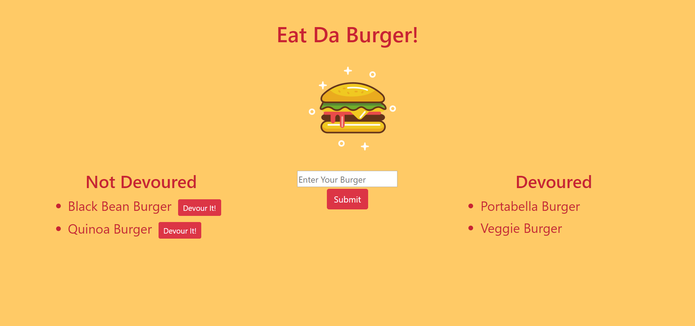

# Eat Da Burger

Eat Da Burger is a Full Stack Application that utilizes Node.js, Express, MySQL, Handlebars, and a custom ORM in an MVC design pattern.

https://secure-caverns-15279.herokuapp.com/

## Description
Users can enter names of burgers they would like to eat, and the information is stored into a MySQL database. Whenever a user submit's a burger name, the app will display the burger on the left side of the page with a "Devour It!" button that will let the user "eat" that selected burger. If the "Devour It!" button is clicked, the information in the database will change for that burger and it will be moved to the right side of the screen.

